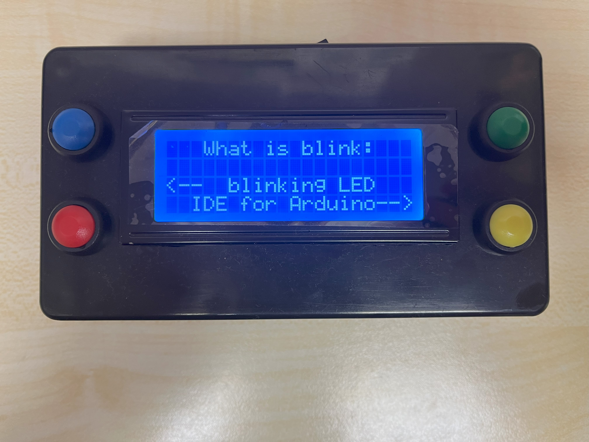

# GameBoy

## 1. Main goal
The main goal of the project was to build a simple game console using C++.

## 2. Project description
After starting the console, a simple interface will appear. From there we can choose whether we want to play a quiz, "RunBoBRun", or maybe we want to get some information about the project. By pressing the appropriate button we can access the selected option. Quizz consists of simple questions that the user answers using a dedicated button. RunBobRun is a simple game in which Bob tries to avoid colliding with objects that are moving towards him. However, after pressing info, we will be redirected to the repository.

The heart of the console is Arduino Nano, the brain of which is ATMega 328. It communicates with a 14x2 LCD liquid crystal display via the I2C interface. Using this method of communication significantly reduced the number of pins used. Additionally, 4 buttons are connected to the uC, two of which are set as interrupts, in order to respond immediately when the button is pressed. The whole thing is powered by a 9V battery, the voltage of which is converted to 5V so that the uC and peripherals can be powered. The elements were connected by soldering on a prototype board. The device casing was purchased online and tailored to your needs. The device also has a main power on/off switch.

## 3. Tools
- arduino nano microcontroller
- LCD liquid crystal display 14x2
- push-pull buttons
- basic electronic elements
- battery

## 4. IT tools:
- VS Code + PlatformIO

## 5. Photos of the heart and device operation

During assembly:

Heart GameBoy:

Start display:

Menu:

Info:

Quiz:

RunBobRun:

Michał Błotniak
